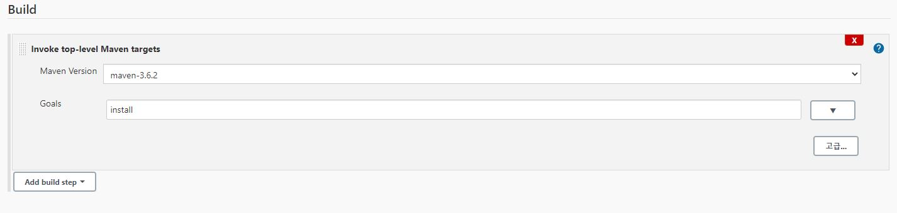

# Auto-deploy Springboot to Jenkins using Docker and Bash
**notice**
- This repository contains sample sources.
- This document uses springboot sources for samples.


## 1. Install Jenkins
- https://www.server-world.info/en/note?os=CentOS_7&p=jenkins

## 2. Install Docker
```bash
  sudo curl -s https://get.docker.com | sudo sh && sudo systemctl start docker && sudo systemctl enable docker
  sudo groupadd docker
  sudo usermod -aG docker $USER
  sudo systemctl start docker
```

## 3. Jenkins Settings(brief explanation)
### 3-1 Source Code Management


### 3-2 Build trigger


### 3-3 Environment Build

**important!**
+ Download **Dockerfile**
+ run **auto_deploy.sh** using "curl"
```bash
  cd ~/apps
  wget https://raw.githubusercontent.com/sohwaje/autodeploy_docker/main/Dockerfile
  bash <(curl -s https://raw.githubusercontent.com/sohwaje/autodeploy_docker/main/auto_deploy.sh) &
```

### 3-4 Build and Save


### 3-5 Build Now


## 4. After deploy
+ The **logs** directory and **heapdump** directory are created in **apps** dir  


### 4-1 Docker container

***

## 5. additional explanation
- You can edit docker **CONTAINER_PORT** and **HOST_PORT** in auto_deploy.sh
  > HOST_PORT="19999"  
  > CONTAINER_PORT="19999"

- Also you can edit **APP_HOME, VERSION, SPRING_PROFILE**
